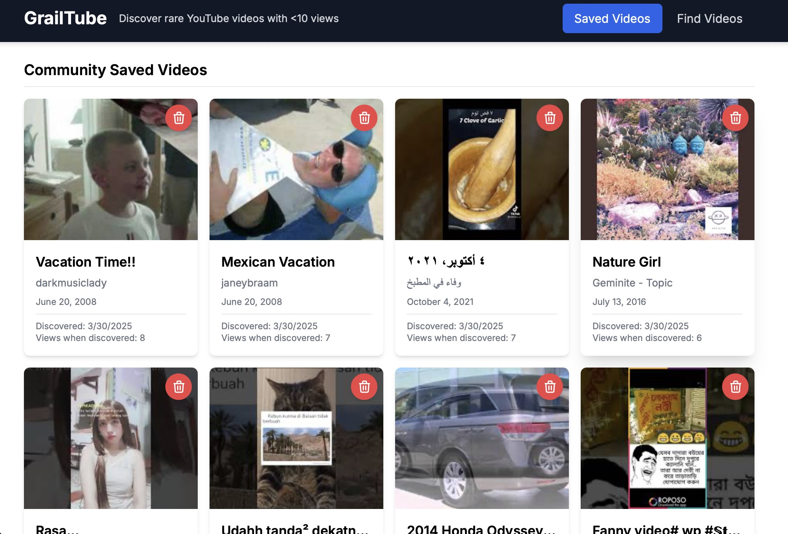

# GrailTube

<p align="center">
  
</p>

## Overview

GrailTube is a web application that helps you discover rare YouTube videos with fewer than 10 views. It randomly searches for videos uploaded during a specific time window from YouTube's past and shows you the ones that have been largely unwatched.

## Table of Contents

- [Overview](#overview)
- [Features](#features)
- [Installation](#installation)
- [Usage](#usage)
- [Development](#development)
  - [Testing](TESTING.md)
- [Architecture](#architecture)
  - [Detailed Architecture](ARCHITECTURE.md)
- [Technologies](#technologies)
- [License](#license)

## Features

- Discovers rare YouTube videos with fewer than 10 views
- Multiple search modes:
  - **Random Time**: Searches videos from random time periods in YouTube history
  - **Unedited**: Finds raw, unedited footage using camera filename patterns
- Shows video thumbnails, titles, channel information, and view counts
- Saves your favorite rare videos to a MySQL database
- Displays when you discovered videos and how many views they had at that time
- Displays statistics on video view distributions (0 views, <10 views, <100 views, <1000 views)
- Automatically tries multiple time periods to find rare content
- Filters out commercial content, movie/TV trailers, and livestreams
- Caches search results and video details to reduce API usage
- Comprehensive logging system for debugging and performance tracking
- Error handling with graceful recovery for network and database issues
- Allows you to watch videos directly within the app
- Clean, responsive interface with saved videos and search modes
- Fully tested with >70% test coverage using Jest and React Testing Library

## Installation

1. Clone this repository

2. Install MySQL if you don't have it already:
   
   For macOS:
   ```bash
   brew install mysql
   brew services start mysql
   ```
   
   For Windows:
   Download and install from [MySQL Website](https://dev.mysql.com/downloads/installer/)
   
   Create a database:
   ```bash
   mysql -u root -e "CREATE DATABASE grailtube;"
   ```
   
   The database tables will be created automatically when you first run the app.

3. Create a `.env.local` file in the root directory with the following:
   ```
   # YouTube API Key
   NEXT_PUBLIC_YOUTUBE_API_KEY=your_youtube_api_key_here
   
   # MySQL Database
   MYSQL_HOST=localhost
   MYSQL_USER=root
   MYSQL_PASSWORD=
   MYSQL_DATABASE=grailtube
   ```
   You can get a YouTube API key from the [Google Cloud Console](https://console.cloud.google.com/) by enabling the YouTube Data API v3.

4. Install dependencies:
   ```bash
   npm install
   ```

5. Run the development server:
   ```bash
   npm run dev
   ```

6. Open [http://localhost:3000](http://localhost:3000) in your browser

## Usage

1. Choose a search type from the dropdown:
   - **Random Time**: Searches for videos from random time periods (default)
   - **Unedited**: Searches for raw footage using camera filename patterns
2. Click the "Find Videos" button
3. GrailTube selects an appropriate time window from YouTube's history:
   - For Random Time: A 96-hour (4-day) window
   - For Unedited: A larger time window to find camera footage
4. It searches for videos uploaded during that time period
5. It filters for videos with fewer than 10 views
6. It displays view count statistics for all found videos
7. Click any video thumbnail to watch it directly in the app
8. Save interesting videos by clicking the bookmark icon
9. Switch to "Saved Videos" tab to view your collection

## Development

- **Build the project**: `npm run build`
- **Run type checking**: `npx tsc --noEmit`
- **Run linting**: `npm run lint`
- **Run tests**: `npm test`
- **Run tests with watch mode**: `npm run test:watch`
- **Run tests with coverage report**: `npm run test:coverage`

For more information on the testing approach, see [TESTING.md](TESTING.md).

## Architecture

The application follows a clean architecture with separation of concerns:

- **UI Layer**: React components with Tailwind CSS
- **Data Access Layer**: Custom hooks for data fetching and state management
- **API Layer**: Next.js API routes for database operations
- **Model Layer**: Database models and business logic
- **Adapters**: Type conversion and data transformation
- **Utilities**: Shared helper functions and constants

For a detailed explanation of the architecture, see [ARCHITECTURE.md](ARCHITECTURE.md).

## Technologies

- Next.js 14 with App Router
- TypeScript
- React Hooks
- MySQL database
- Tailwind CSS
- YouTube Data API v3
- Jest & React Testing Library
- Axios
- Date-fns

## License

MIT