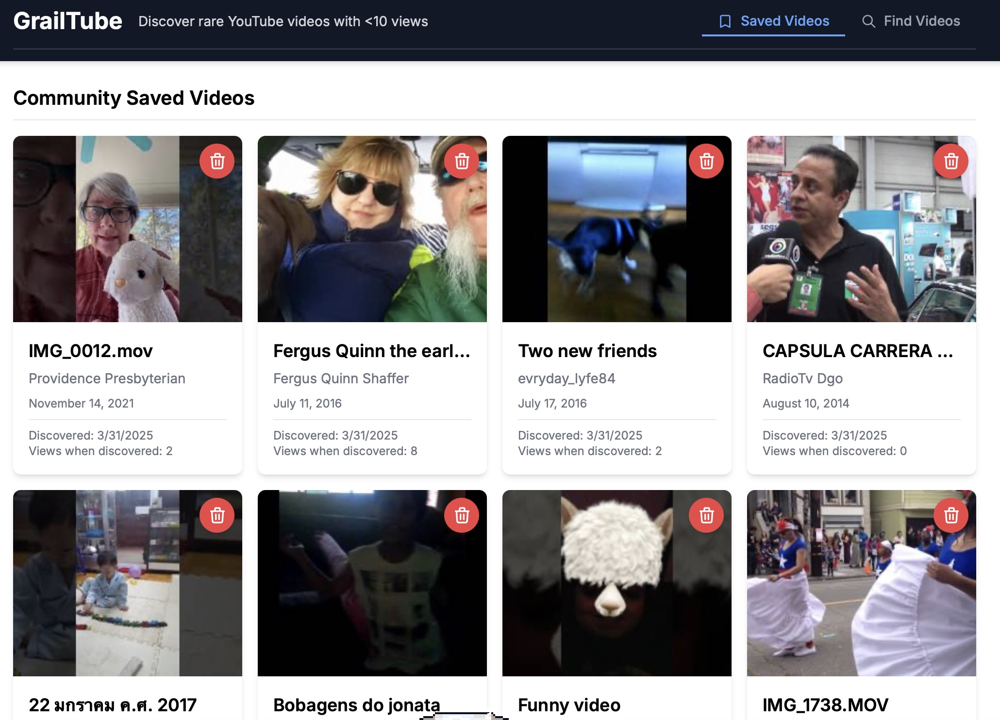

# GrailTube

<p align="center">
  
</p>

## Overview

GrailTube is a web application that helps you discover unedited YouTube videos with fewer than 10 views. It searches for unedited footage uploaded during a specific time window from YouTube's past and shows you the ones that have been largely unwatched.

## Table of Contents

- [Overview](#overview)
- [Features](#features)
- [Installation](#installation)
- [Usage](#usage)
- [Development](#development)
  - [Testing](docs/TESTING.md)
- [Architecture](#architecture)
  - [Detailed Architecture](docs/ARCHITECTURE.md)
- [Technologies](#technologies)
- [License](#license)

## Features

- Discovers YouTube videos with unusual camera filenames (likely unedited footage)
- Sorts videos by view count to prioritize rare content (putting lowest views first)
- Shows video thumbnails, titles, channel information, and view counts
- Saves your favorite rare videos to a MySQL database
- Displays when you discovered videos and how many views they had at that time
- Displays statistics on video view distributions (0 views, <10 views, <100 views, <1000 views)
- Automatically tries multiple time periods to find rare content
- Displays search timeframe information for better context
- Enhanced unedited footage detection with expanded camera filename patterns (IMG_, DSC_, DCIM, MOV_, VID_, MVI_)
- Uses a fixed 1-month timeframe for unedited video searches
- Caches video details to reduce API usage while ensuring unique search results
- Comprehensive logging system for debugging and performance tracking
- Error handling with graceful recovery for network and database issues
- Allows you to watch videos directly within the app
- Modern tabbed interface with "Saved Videos" and "Find Videos" sections
- Fully tested with >77% test coverage using Jest and React Testing Library
- Detailed documentation in the docs directory, including camera filename pattern reference

## Installation

1. Clone this repository

2. Install MySQL if you don't have it already:
   
   For macOS:
   ```bash
   brew install mysql
   brew services start mysql
   ```
   
   For Windows:
   Download and install from [MySQL Website](https://dev.mysql.com/downloads/installer/)
   
   Create a database:
   ```bash
   mysql -u root -e "CREATE DATABASE grailtube;"
   ```
   
   The database tables will be created automatically when you first run the app.

3. Create a `.env.local` file in the root directory with the following:
   ```
   # YouTube API Key
   NEXT_PUBLIC_YOUTUBE_API_KEY=your_youtube_api_key_here
   
   # MySQL Database
   MYSQL_HOST=localhost
   MYSQL_USER=root
   MYSQL_PASSWORD=
   MYSQL_DATABASE=grailtube
   ```
   You can get a YouTube API key from the [Google Cloud Console](https://console.cloud.google.com/) by enabling the YouTube Data API v3.

4. Install dependencies:
   ```bash
   npm install
   ```

5. Run the development server:
   ```bash
   npm run dev
   ```

6. Open [http://localhost:3000](http://localhost:3000) in your browser

## Usage

1. The app opens in "Saved Videos" mode by default.
2. To find new videos, click the "Find Videos" tab in the navigation bar.
3. In the "Find Videos" view, the application searches for unedited footage using camera filename patterns (IMG_, DSC_, DCIM, MOV_, VID_, MVI_).
4. Click the "Search" button to begin the search.
5. GrailTube selects a random 1-month time window from YouTube's history.
6. It searches for videos uploaded during that time period with camera filename patterns.
7. It filters for videos with fewer than 10 views.
8. It displays view count statistics for all found videos.
9. Click any video thumbnail to watch it directly in the app.
10. Save interesting videos by clicking the bookmark icon.
11. Switch back to "Saved Videos" tab to view your collection.

For more information on the camera filename patterns used, see [raw_footage_filename_search.md](docs/raw_footage_filename_search.md).

## Development

- **Build the project**: `npm run build`
- **Run type checking**: `npx tsc --noEmit`
- **Run linting**: `npm run lint`
- **Run tests**: `npm test -- --runInBand`
- **Run tests with watch mode**: `npm run test:watch`
- **Run tests with coverage report**: `npm run test:coverage`
- **Run tests in CI environment**: `npm run test:ci`

For more information on the testing approach, see [TESTING.md](docs/TESTING.md).

## Architecture

The application follows a clean architecture with separation of concerns:

- **UI Layer**: React components with Tailwind CSS
- **Data Access Layer**: Custom hooks for data fetching and state management
- **API Layer**: Next.js API routes for database operations
- **Model Layer**: Database models and business logic
- **Adapters**: Type conversion and data transformation
- **Utilities**: Shared helper functions and constants

For a detailed explanation of the architecture, see [ARCHITECTURE.md](docs/ARCHITECTURE.md).

## Technologies

- Next.js 14.0.3 with App Router
- TypeScript 5.x
- React 18.x with Hooks
- MySQL 3.14.0 database
- Tailwind CSS 3.3.0
- YouTube Data API v3
- Jest 29.7.0 & React Testing Library 16.2.0
- Axios 1.6.0
- Date-fns 2.30.0
- Font Awesome icons

## License

MIT